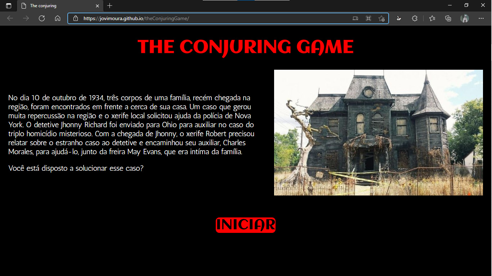

# The Conjuring Game 💀💻

The Conjuring Game é um textual game de terror baseado em uma história criada por mim. A história possui 3 personagens jogáveis e cada um deles possui fases e uma historia.

E eu convido você a jogar e descobrir mais sobre a história.

## Imagem do jogo💻

## Como foi feito?🤔

O jogo foi feito com HTML para alocar os textos e CSS para estilização. Também utilizei Java Scrit para desenvolver uma função de troca de páginas.

## Tecnologias utilizadas🦉

<ul>
    <li>HTML</li>
    <li>CSS</li>
    <li>Java Script</li>
</ul>

## Autor 😊

### João Victor dos Santos Moura
### Github : jovimoura
### Email : joaovictors.mouraa@gmail.com